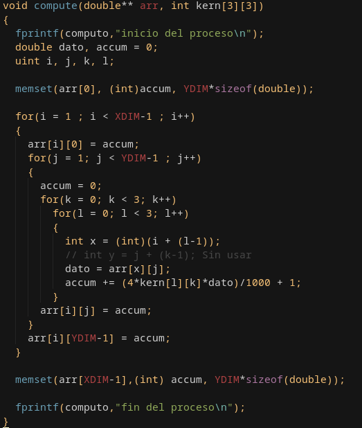

# Sistemas operativos 2-Trabajo practico 3
## Informe
### Equipo de pruebas
El equipo ultilizado para las pruebas es el siguiente:

Los resultados que se exponen corresponden a la mejor de 3 pruebas que se ejecutan con el script *init* en la raiz del proyecto. A lo largo del informe se enumeran los cambios generados en el archivo [archivo base](./src/lab3_base.c), apartir del cual surgen las comparativas para considerar una mejora o no en el rendimiento de la ejecucion.

### Primera ejecucion
La primera ejecucion corresponde al archivo base descargado del informe. El mismo tardo mas tiempo del que se comenta enel profiling, asumo que es el gran numero de prints que generan una lentitud en la consola, apesar de que la ejecucion como tal ya termino.

 %     | cumulative | self    |        | self     | total           
 ---   | ---        | ---     | ---    | ---      | ---
 time  | seconds    | seconds | calls  | s/call   | s/call  name    
 73.52 | 22.10      | 22.10   | 1      | 22.10    | 22.10  compute
 24.45 | 29.45      | 7.35    | 1      | 7.35     | 7.35  print
 0.93  | 29.73      | 0.28    | 1      | 0.28     | 0.28  fill
 0.70  | 29.94      | 0.21    | 1      | 0.21     | 0.21  alloc_matrix
 0.40  | 30.06      | 0.12    |        |          |     _init

Obteniendo un acumulado de 30.06
___
### Primer Cambio
> Como habia una tardanza en la muestra de los datos, tal vez sea mejor llevarlos a un log el cual lo iba a guardar alli.

 %     | cumulative | self    |       | self   | total           
 ---   | ---        | ---     | ---   | ---    | ---
 time  | seconds    | seconds | calls | s/call | s/call name    
 89.41 | 15.11      | 15.11   | 1     | 15.11  | 15.11  compute
 7.57  | 16.39      | 1.28    | 1     | 1.28   | 1.28   print
 1.42  | 16.63      | 0.24    | 1     | 0.24   | 0.24   alloc_matrix
 1.18  | 16.83      | 0.20    | 1     | 0.20   | 0.20   fill
 0.41  | 16.90      | 0.07    |       |        |        _init

El tiempo de ejecucion acumulado fue de 16.90s, es decir, casi la mitad.

Es decir, se abrieron 2 archivos, y en los cuales se escriben los 2 print que anteriormente estaban en el programa.
Comparandos las tablas se ve una disminucion en las 2 funciones modificadas.
___
### Segundo Cambio
> Para el primer cambio me olvide de cambiar las flags de compilacion, por lo tanto me saltie los warnings que habia en el.
Los warnings corregidos fueron:

Los errores de conversion se castearon, los sin uso estan comentados y las llaves se colocaron.

 %     | cumulative | self    |       | self   | total           
 ---   | ---        | ---     | ---   | ---    | ---
 time  | seconds    | seconds | calls | s/call | s/call name    
 88.26 | 14.13      | 14.13   | 1     | 14.13  | 14.13  compute
 8.37  | 15.47      | 1.34    | 1     | 1.34   | 1.34   print
 2.00  | 15.79      | 0.32    | 1     | 0.32   | 0.34   alloc_matrix
 0.87  | 15.93      | 0.14    | 1     | 0.14   | 0.14   fill
 0.50  | 16.01      | 0.08    |       |        |        _init

El tiempo acumulado fue de 16.01 s. Es un cambio muy pequeño respecto a la prueba anterior, pero el resto de pruebas arrojaron resultados inferiores en todas las pruebas, por lo tanto hubo una mejoria de algun tipo.
___
### Tercer Cambio
> La funcion *alloc_matrix* tiene 1 loop donde alloca memoria y otro donde coloca un valor en las columnas del mismo. Se intento reducir la cantidad de loops, pero era necesario cambiar la forma de asignacion, la cual en **Cambios descartados** se detalla en profundidad.
Los cambios hechos fueron, cambiar los valores a *unsigned int* para que todos trabajen sin signo, y cambiar los for a while decrecientes por lo que se comenta en [LOOP INVERSION](http://icps.u-strasbg.fr/~bastoul/local_copies/lee.html):

 %     | cumulative | self    |       | self   | total           
 ---   | ---        | ---     | ---   | ---    | ---
 time  | seconds    | seconds | calls | s/call | s/call  name    
 88.51 | 13.63      | 13.63   | 1     | 13.63  | 13.63  compute
 8.12  | 14.88      | 1.25    | 1     | 1.25   | 1.25  print
 1.69  | 15.14      | 0.26    | 1     | 0.26   | 0.26  fill
 1.30  | 15.34      | 0.20    | 1     | 0.20   | 0.20  alloc_matrix
 0.39  | 15.40      | 0.06    |       |        |       _init

Es realmente muy dificil considerar si hubo una mejoria o no, los numeros indican que si pero otras ejecuciones podrian reflejar que no hubo tanto cambio, de toda formas se queda ya que parece aportar un poco a la ejecucion.

### Cuarto Cambio
> Revisando todas las tablas se ve que la funcion que mas tiempo ocupa es compute, al revisarla se ven varios bucles y operaciones que parecen estar de mas, podemos ver los siguientes puntos.

* Hay un if dentro del for que solamente excluye las 4 primeras iteraciones y la ultima, entonces para salvar ese chequeo se hacen manualmente previa y a posterior del ciclo
* Se repite 2 veces los ciclos que escribe y lee el *temp_sum*, esta se puede simplificar y hacer en uno sola ya que la suma no va a ser afectada por el orden. Este ciclo se puede quitar y hacer secuencialmente pero creo que no justifica el rendimiento
* La variable acum se estaba asignando sin definir, por lo tanto en la ejecucion original hay valores incoherentes, esto se considero erroneo y se asigno a 0. (Decision de diseño)

 %  | cumulative  | self      |       | self    | total
 --- | --- | --- | --- | --- | ---
 time  | seconds  | seconds   | calls  | s/call  | s/call  name    
 85.75   |  10.29 | 10.29       | 1   | 10.29   | 10.29  compute
 9.83    | 11.47    | 1.18       | 1    | 1.18    | 1.18  print
 2.17    | 11.73    | 0.26       | 1    | 0.26    | 0.26  fill
 1.92    | 11.96    | 0.23       | 1    | 0.23    | 0.23  alloc_matrix
 0.33 | 12.00    | 0.04          |       |           | _init

Se ve una disminucion en los tiempos y la salida del programa ahora resulta mas coherente.
___
### Quinto Cambio (O tercer cambio bis)
> Luego de la modificacion anterior, decidi tomarme ciertas decisiones de diseño con el fin de mejorar el rendimiento sin afectar el programa en si, este es el caso de el alocamiento y seteo el cual se hacia de una manera inncesaria dado que luego se iba a llenar con otros simbolos. Por esta razon se dejo solo 1 bucle y se seteo a 0 en una sola iteracion.

 % | cumulative  | self      |       | self    | total           
 --- | --- | --- | --- | --- | --- 
 time  | seconds  | seconds   | calls  | s/call  | s/call  name    
 86.98    | 10.22   | 10.22       | 1   | 10.22   | 10.22  compute
 9.62    | 11.35    | 1.13       | 1    | 1.13    | 1.13  print
 3.06    | 11.71    | 0.36       | 1    | 0.36    | 0.36  fill
 0.34    | 11.75    | 0.04       |      |         |       _init
 0.00    | 11.75    | 0.00       | 1    | 0.00    | 0.00  alloc_matrix

Si bien este cambio es pequeño en la cantidad de tiempo ahorrada, deja en 0 practicamente el tiempo dedicado a la funcion *alloc_matrix*, por lo tanto me parece una excelente inclusion.
___
### Sexto Cambio
> Lo que mas realentiza el programa viene siendo el I/O. El cambio a fprintf funciono pero no fue suficiente para aceptar dejarlo asi. Por lo tanto se elimino el loggeo inncesario de la funcion *compute*. 

 %  | cumulative  | self     |        | self    | total           
 --- | --- | --- | --- | --- | ---
 time  | seconds  | seconds   | calls  | s/call  | s/call  name    
 87.48      | 9.57    | 9.57       | 1    | 9.57    | 9.57  compute
 9.87    | 10.65    | 1.08       | 1    | 1.08    | 1.08  print
 2.29    | 10.90    | 0.25       | 1    | 0.25    | 0.25  fill
 0.37    | 10.94    | 0.04       |      |         |       _init
 0.00    | 10.94    | 0.00       | 1    | 0.00    | 0.00  alloc_matrix

Se puede ver una pequeña mejoria en los tiempos en general.
Como dato extra de las Op de I/O estas representan un tiempo enorme para que se ejecuten, solamente hace falta ver la siguiente comparativa. 
Si vemos la imagen se ve que el time stamp del script es mucho mayor que el tiempo que indica el profiling, esto se debe a que el tiempo que se insume en las operaciones de entrada y salida no se ve reflajado.

Si comentamos estas funciones de entrada y salida podemos ver:

Dejando expuesto la cantidad de tiempo que se insume en estas operaciones.
___
### Conclusiones
Si bien el informe esta sujeto a cambios que se van a ir agregando cuando amerite, estas son las propuestas evaluadas yy aceptadas hasta la fecha. Se redujo 3 veces el tiempo de ejecucion (Sin contar la I/O sino seria mucho mas). el trabajo ha sido de gran ayuda para ilustar los conceptos vistos en clase y ademas dejar en claro que no siempre la opcion mas practica en la mejor.
A modo de conclusion se genero una tabla y un grafico a partir de ella.

 |              | Cambio 0 | Cambio 1	| Cambio 2	| Cambio 3	| Cambio 4	| Cambio 5	| Cambio 6
 | ---            | ---      | ---        | ---           | ---           | ---           | ---           | ---
 | Compute	| 22,1	   | 15,11	| 14,13	        | 13,63	        | 10,29	        | 10,22	        | 9,57
 | Print	        | 7,35	   | 1,28	| 1,34	        | 1,25	        | 1,18	        | 1,13          | 1,08
 | Fill	        | 0,28	   | 0,2	| 0,14	        | 0,26	        | 0,26	        | 0,36	        | 0,25
 | Alloc_matrix	| 0,21	   | 0,24	| 0,32	        | 0,2	        | 0,23	        | 0	        | 0
 | Total	        | 30,6	   | 16,9	| 16,01	        | 15,4	        | 12	        | 11,75	        | 10,94

___
### Update #1 
En el **cambio 4** se simplificaron varios for con el objetivo de reducir el overhead que generaria tener un if dentro de un bucle. Esta simplificacion a decir verdad no era coherente con la original, ya que ignoraba que el *if* filtraba los bordes de la matriz, cosa que ignore en su momento pero ahora vine a corregir.

 time  | seconds  | seconds   | calls  | s/call  | s/call  name    
 --- | --- | --- | --- | --- | ---
 87.23   | 9.43    | 9.43       | 1    | 9.43    | 9.43  compute
 9.71    | 10.48    | 1.05       | 1   | 1.05    | 1.05  print
 2.22    | 10.72    | 0.24       | 1    | 0.24    | 0.24  fill
 0.83    | 10.81    | 0.09       |      |         |       _init
 0.00    | 10.81    | 0.00       | 1    | 0.00    | 0.00  alloc_matrix

Los resultados son raros deberian empeorar los tiempos pero no esta sucediendo, asumo que es el estado del equipo al momento de la ejecucion ya que las 3 pruebas que se hicieron arrojaron el mismo resultado.

### Update #2 
Ademas se realizaron las mismas pruebas en una pc con mayor cantidad de recursos:

La tabla de prubas quedaria de la siguiente manera.

 |              | Cambio 0 | Cambio 1	| Cambio 2	| Cambio 3	| Cambio 4	| Cambio 5	| Cambio 6
 | ---            | ---      | ---        | ---           | ---           | ---           | ---           | ---
 | Compute	| 7,79	   | 5,06	| 4,99	        | 4,88	        | 3,39	        | 3,92	        | 3,45
 | Print	        | 0,6	   | 0,24	| 0,19	        | 0,17	        | 0,19	        | 0,18         | 0,18
 | Fill	        | 0,21	   | 0,16	| 0,18	        | 0,10	        | 0,18	        | 0,14	        | 0,17
 | Alloc_matrix	| 0,21	   | 0,10	| 0,16	        | 0,16	        | 0,13	        | 0	        | 0
 | Total	        | 8,77	   | 5,65	| 5,6	        | 5,37	        | 3,93	        | 4,22	        | 3,81

Si analizamos rapidamente los resultados resulta un poco mas dificil ver los cambios de rendimiento que en el caso de la pc de menores recursos.
___
### Cambios descartados
* En la funcion *alloc_matrix* se intento separar el malloc en 1 solo for, el mismo tambien empeoro los tiempos, por alguna razon cuando el acceso  la direccion de memoria se hace incrementando el valor de la izquierda, hay un acceso practicamente 2 veces mas rapido. Esto resulta ilustrador, y es de lo que habla en [COLUMN-MAJOR ACCESSING](http://icps.u-strasbg.fr/~bastoul/local_copies/lee.html), sinceramente la idea intuitiva hubiera sido al reves.
* Cambiar el while agregado en *alloc_matrix* por un for desenrrollado mostro que en algunas iteraciones era mas rapido pero en otras este empeoraba
* El uso de flag no bloqueante con file descriptors
* Quitar o modificar los bucles con el random, desconozco la importancia de esa caracteristica
* Quitar o modificar el bucle print, ahi lo que tarda es el printf, no se no el bucle
* Cambiar los tipos de las variables, ya que estas parecian ser las correctas

## Herramientas de profiling
### Cachegrid con callgrid
Es un cache profiler, que provee una simulacion detallada de la cache en el cpu, sirve para idenficiar los *cache missed* y contarlos, tambien ver las referencias a memoria y instrucciones ejecutando linea a linea. Callgrid es una extension que ademas provee *callgraphs*, y una GUI para visualizar mejor la salida de Cachegrid.

### AppDynamics
Este software de ciscoes un gestor de performance y analizador de operaciones, se enfocan en el manejo de performance en entornos de la nube y arquitecturas en red.

### CodeXl (AMD)
Una profiler con una GUI muy comoda que usa el profiling especifico del hardware ya que este esta diseñado y funciona en procesadores AMD, pero ademas posee tecnicas de lo profiling que se pueden utilizar enprocesadores no necesariamente AMD. En Abril de 2020 este dejo de tener soporte de parte de AMD por lo cual su repositorio esta archivado.
